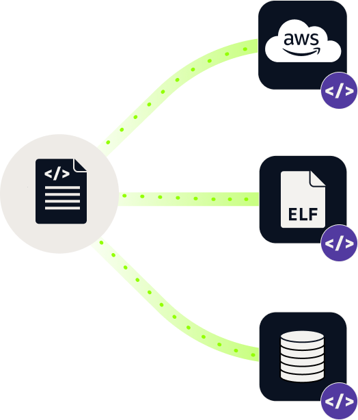
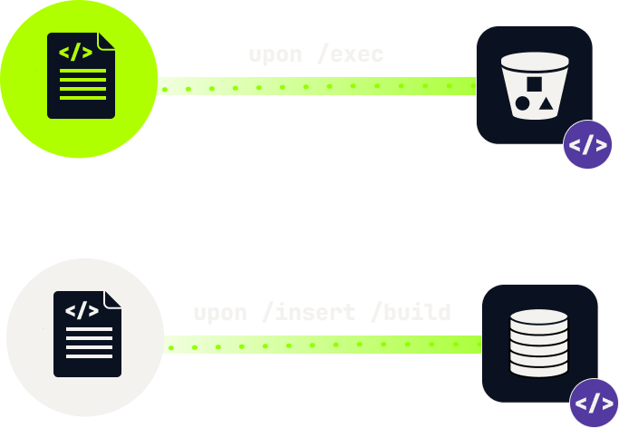

# About

Chalk supports collecting a wide range of metadata. The type of data to be
collected, the directives that define _when_ collection will happen, as well as
the specification of _where_ the collected metadata will be getting _sent to_
is defined in _chalk configurations (configs)_. In this section, we will cover
the core components of a chalk config, and how they come together.

# Reports

Reports are at the core of chalk, because ultimately it is reports that are being
accessed by users. We ask chalk to collect metadata we care about,
and that metadata _always_ ends up in a _report_, which is always in JSON format.

Think of the report as a document or binary object, which is sent to an output
destination: it can be embedded in an artifact (e.g., injected in an
executable), sent to a web endpoint, stored to a local or remote filesystem etc.



A report might be getting emitted under different conditions - most often this
is done during core chalk operations, such as an `insert`, `exec`, etc. but
reports can also be configured to be getting emitted periodically or when a
condition is met.

How exactly we can configure reports to be emitted, and what data ends
being part of a report is discussed in the sections below.

## Templates

The exact metadata that will be getting included in a report are defined in
_templates_ which are simply collections of metadata keys (with optional conditions
on when said metadata should be getting emitted). The same template
can be re-used across many reports, however each of the different reports
making use of the template could have different trigger/generation condidtions
and different destinations.

Here is an excerpt from the template used by default for any metadata extracted
upon a chalk `insert` operation:

```con4m

report_template insertion_default {
  shortdoc: "The default template for insertion operations"
  ...
  if not in_container() {
    key._OP_ALL_PS_INFO.use                   = false
  }
  key.CHALK_VERSION.use                       = true
  key.DATE_CHALKED.use                        = false
  key.TIME_CHALKED.use                        = false
  key.TZ_OFFSET_WHEN_CHALKED.use              = false
  key.DATETIME_WHEN_CHALKED.use               = false
  key.EARLIEST_VERSION.use                    = false
  ...
  # Runtime host keys.
  key._ACTION_ID.use                          = true
  key._ARGV.use                               = true
  key._ENV.use                                = true
  key._TENANT_ID.use                          = true
  key._OPERATION.use                          = true
  key._TIMESTAMP.use                          = true
  ...
}
```

We define a report template using the `report_template` type definition, followed by the
template name (in this case `insertion_default`). We notice that the template
contains definitions about what metadata keys to export (set to `true`), and which
to avoid (set to false) and under which conditions. For instance, if we are not within a docker container,
`_OP_ALL_PS_INFO` metadata will not be getting emitted. For the purposes of this
guide, you do not need to worry about what the individual metadata keys are, or the
differences between naming conventions (e.g., keys starting with `_` vs not).
All you need to know is that we can define if we care about them inside templates.

> You can read more about metadata keys and their semantics or restrictions in [the metadata reference](/docs/chalk/metadata).

## Chalkmarks

Chalkmarks are _always embedded_ in an artifact (e.g., an ELF file, or docker
container). Contrary to regular reports, there are restrictions on what metadata can be
included in a chalkmark. In particular, no metadata that is collected at runtime
(such as network connections) can be included in chalkmarks.

Templates that define what keys are included in a chalkmark have a special type of
`mark_template`. For instance, here is the "minimal" `mark_template` which comes
as a built-in with chalk:

```con4m
mark_template minimal {
  shortdoc: "Used for minimal chalk marks."
  doc: """

This template is intended for when you're durably recording artifact
information, and want to keep just enough information in the mark to
facilitate other people being able to validate the mark.

This is the default for `docker` chalk marks.
"""
  key.DATETIME_WHEN_CHALKED.use               = true
  key.CHALK_PTR.use                           = true
  key.SIGNATURE.use                           = true
  key.INJECTOR_PUBLIC_KEY.use                 = true
  key.$CHALK_CONFIG.use                       = true
  key.$CHALK_IMPLEMENTATION_NAME.use          = true
  key.$CHALK_LOAD_COUNT.use                   = true
  key.$CHALK_PUBLIC_KEY.use                   = true
  key.$CHALK_ENCRYPTED_PRIVATE_KEY.use        = true
  key.$CHALK_ATTESTATION_TOKEN.use            = true
}
```

In chalk, metadata keys that start with an `_` denote that the metadata is
collected at runtime. For instance, `_TIMESTAMP` corresponds to the timestamp
at the time of the _chalk operation_

# Chalk Configurations

A chalk configuration is a collection of specifications that define _when_ reports
are to be created (what will be the condition for publishing the reports) and _where_
reports are to be sent (what will be the _sinks_ for the reports). Moreover,
they contain information on what templates are to be used for the different
reports.

## Sinks

A report can be sent to one or more destinations (sinks), such as the local
filesystem, an S3 bucket etc. For instance, the following snippet defines a sink named
`log_file_sink`, which denotes that _reports sent to it_ will be getting stored in local disk at "./test_sink.log"

```con4m
sink_config log_file_sink {
  sink: "file"
  filename: "./test_sink.log"
}
```

> For more information on the types of the sinks supported see the [output configuration documentation](/docs/chalk/output-config),

Virtually all output in Chalk is handled through a 'pub-sub'
(publish-subscribe) model. Chalk actions "publish" data to "topics", then sinks
listen ("subscribe") on those topics. For instance, to send _all_ reports to
your newly created `log_file_sink` you may specify

```con4m
subscribe("report", "log_file_sink")
```

Chalk comes with a set of sinks already configured for both chalkmarks and reports,
and different chalk operations send data to different sinks by default.

> For a full list of what sinks are active for the different chalk operations see [here](TODO).

## Writing a custom config with a custom template

Let's write a config that uses two templates to send data to two different sinks:
One template is used to send data to an S3 bucket in AWS and another template is
used to populate data in a rotating file log in the local filesystem.
We only want to send to S3 upon an `exec` and send all available information to
it (using the builtin `report_all` template, whereas we only want to send a
select set of information to the local filesystem upon a `build` and `insert` operation.
This is depicted in the following figure:



The configuration achieving the above is the following:

```con4m
# suppress stdout logs unless there is an error
log_level: "error"

# disable terminal output
custom_report.terminal_chalk_time.enabled: false
custom_report.terminal_other_op.enabled: false

# disable writing to default log
unsubscribe("report", "default_out")

# minimal report template
report_template report_localdisk {
  key.CHALK_VERSION.use                       = true
  key.DATETIME_WHEN_CHALKED.use               = true
  key.HOSTINFO_WHEN_CHALKED.use               = true
  key.NODENAME_WHEN_CHALKED.use               = true

  key._DATETIME.use                           = true
  key._CHALKS.use                             = true
  key._OP_ERRORS.use                          = true

  key.CHALK_ID.use                            = true
  key.PATH_WHEN_CHALKED.use                   = true
  key.ARTIFACT_TYPE.use                       = true
  key.OLD_CHALK_METADATA_ID.use               = true
  key.EMBEDDED_CHALK.use                      = true
  key.METADATA_ID.use                         = true
  key.DOCKER_FILE.use                         = true
  key.DOCKERFILE_PATH.use                     = true
  key.DOCKER_LABELS.use                       = true
  key.DOCKER_TAGS.use                         = true
  key._CURRENT_HASH.use                       = true
  key._VIRTUAL.use                            = true
  key._IMAGE_ID.use                           = true
  key._INSTANCE_CONTAINER_ID.use              = true
  key._INSTANCE_CREATION_DATETIME.use         = true
  key._REPO_TAGS.use                          = true
}

sink_config s3_sink_config {
  enabled: true
  sink:    "s3"
  uri:     env("AWS_S3_BUCKET_URI")
  secret:  env("AWS_SECRET_ACCESS_KEY")
  uid:     env("AWS_ACCESS_KEY_ID")
}

# set up a custom template for saving information locally
sink_config chalk_log_file {
  sink: "rotating_log"
  enabled: true
  max: <<10mb>>
  filename: "/tmp/chalk_insert_build"
}

custom_report chalk_localdisk_logger {
  report_template: "report_localdisk"
  sink_configs: ["chalk_log_file"]
  use_when: ["insert", "build"]
}

custom_report chalk_s3_logger {
  report_template: "report_all"
  sink_configs: ["s3_sink_config"]
  use_when: ["extract"]
}

```

Notice that we have also suppreassed local terminal output for the above report.

### Updating the used templates

Often times you won't need to write a custom config, but simply overwrite the builtin
configuration, changing the default output for a given chalk operation or updating
the used templates. This is easy in con4m. For instance, the default output configuration
for `insert` is as follows:

```con4m
outconf insert {
  mark_template:          "mark_default"
  report_template:        "insertion_default"
}
```

If you want to use a "minimal" template for chalks inserted during an insert,
all you need to specify in your config is

```con4m
outconf insert {
  mark_template:          "mark_minimal"
  report_template:        "insertion_default"
}
```

and that will overwrite the defaults.

If you want to use your own custom template, that you defined in your config,
you may use that as well. For instance, assuming we have a `report_localdisk`
template as in the previous section, we can specify

```con4m
outconf insert {
  mark_template: "minimal"
  report_template: "report_minimal"
}
```
